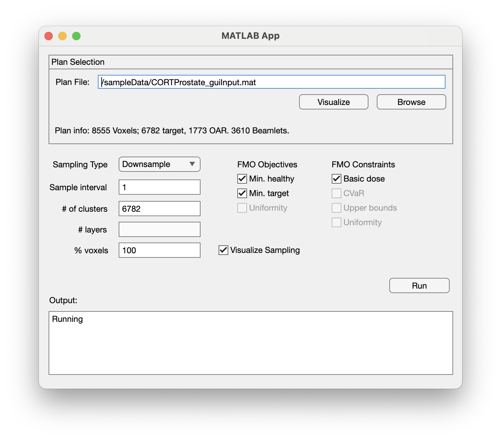
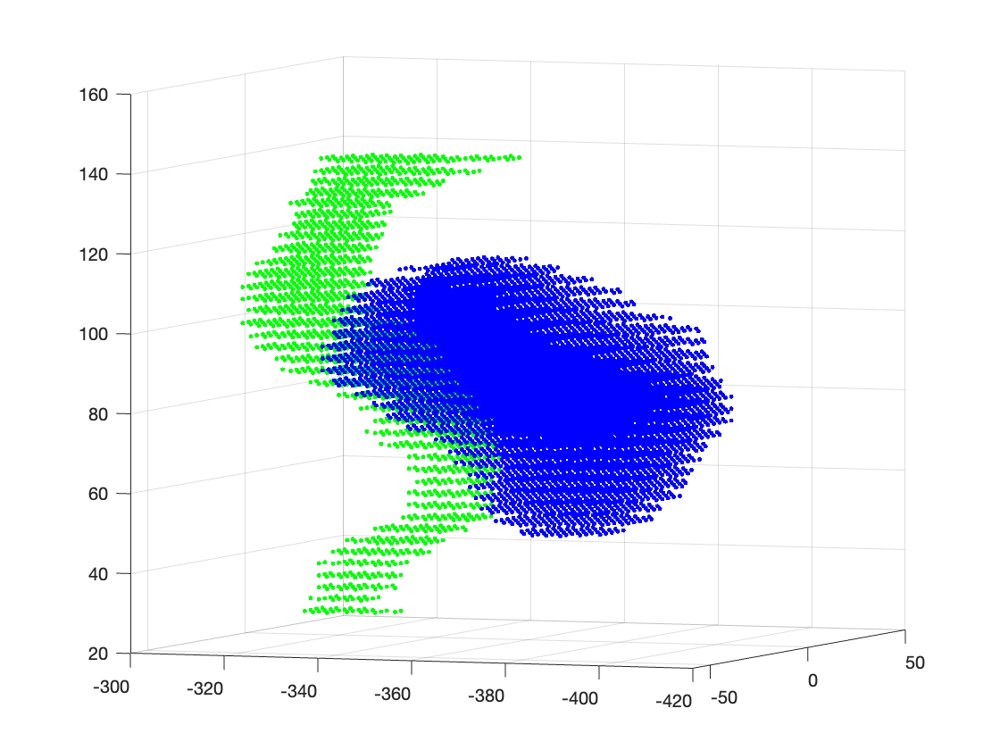
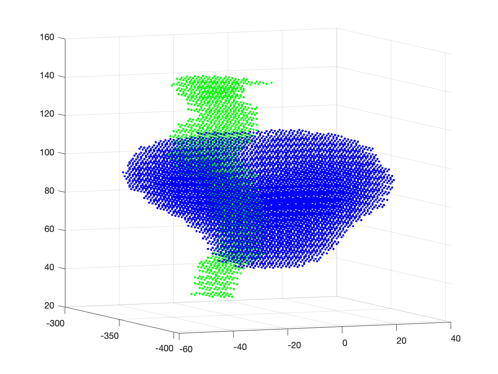
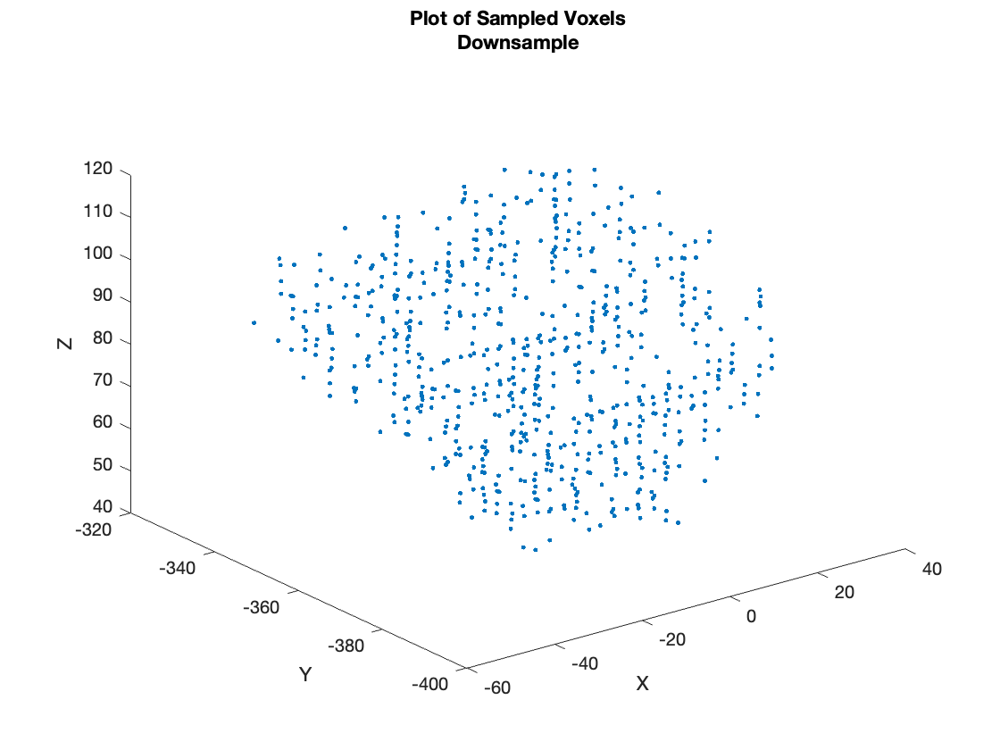
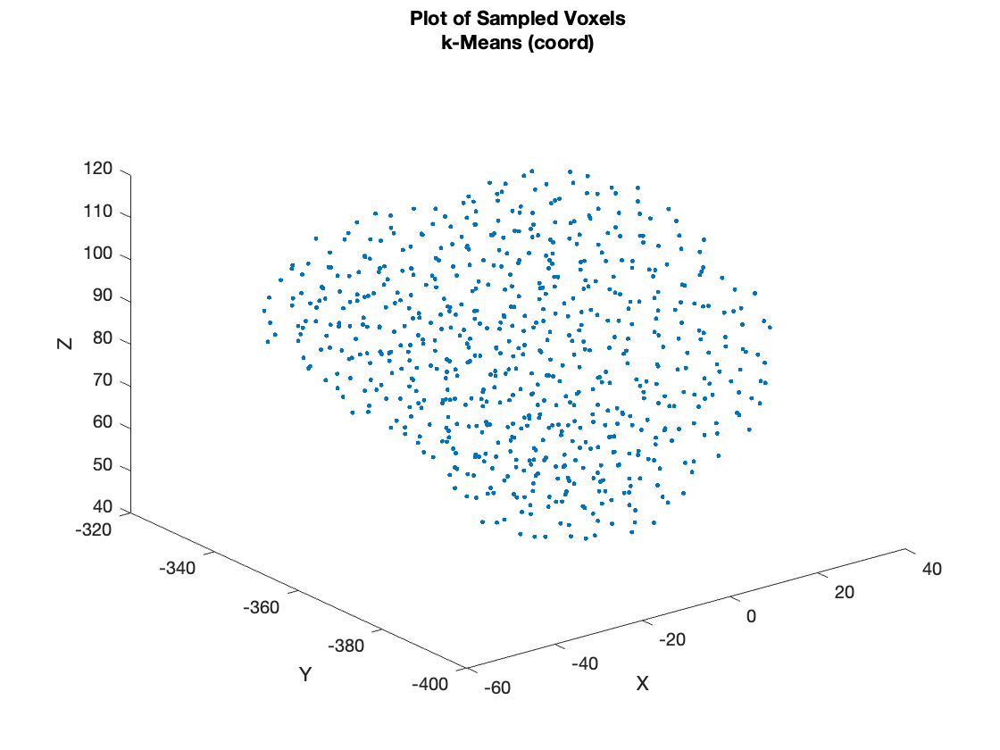
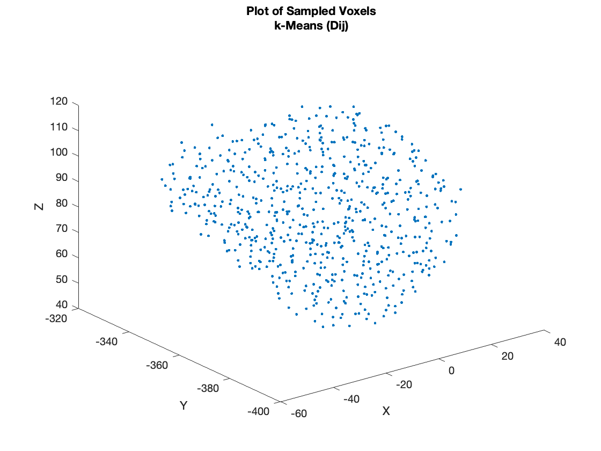
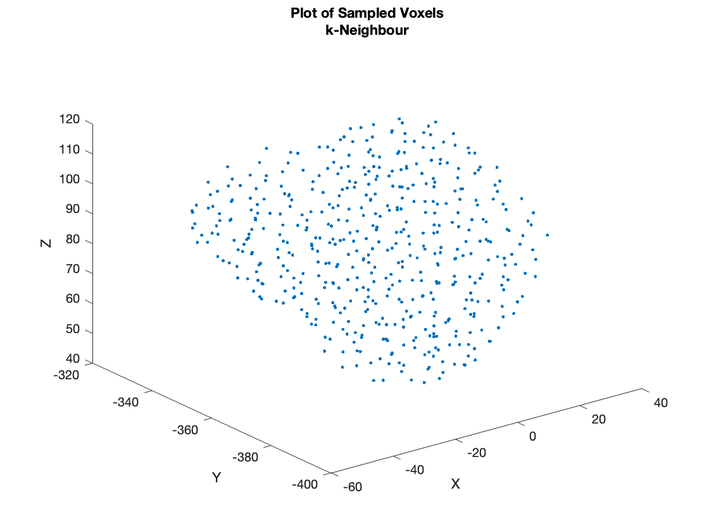
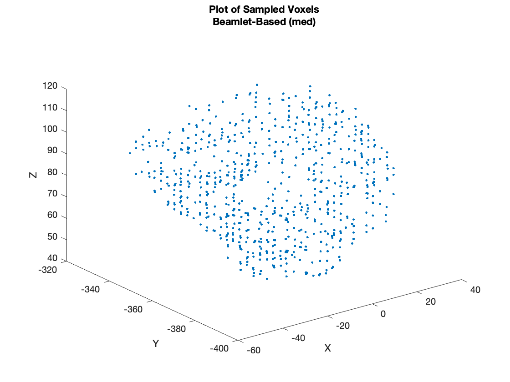
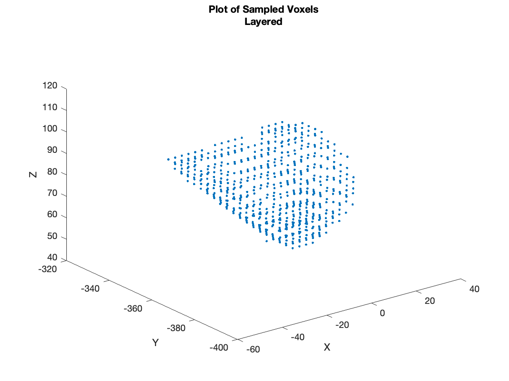

# The Sampling RT Pipeline

Welcome! This is a sampling pipeline setup, specifically calibrated for intensity modulated radiation therapy, or IMRT  treatments, but extensible to other modalities/problems.

The pipeline takes in a specific Matlab .mat structure (outlined below), and provides sampling options through a GUI.

To run the application, open samplingBenchmarkInterface.mlapp, run it to start the GUI, enter your custom parameters, select a .mat file, and run your cases. If you have an older version of Matlab that doesn't have app designer, we've also exported the GUI code to samplingBenchmarkInterface_exported.m. Running this should equivalently get the GUI running for you! 

The sampling takes place in Matlab scripts, then the output is passed into a mexed in c++ file, that takes Matlab input, and runs a simple fluence map optimization using CPLEX.

Note, we do see the irony of releasing an open-source project that requires both CPLEX and Matlab. Unfortunately, for the ease of the pipeline both are necessary. CPLEX is free for download if you are a student and instructions are give below. Professionals may also be able to obtain a limited licence. 

## Installation guide for Windows

1. Install [CPLEX](https://community.ibm.com/community/user/datascience/blogs/xavier-nodet1/2020/07/09/cplex-free-for-students?CommunityKey=ab7de0fd-6f43-47a9-8261-33578a231bb7&tab=) (links to student download site)

* Make sure to keep track of the path to the following folders on your computer

* `C:\…\CPLEX_Studio201\cplex`

* `C:\…\CPLEX_Studio201\concert`

2. Install the Visual Studio C/C++ Compiler (if you don't already have one)

* This application relies on the use of MATLAB mex files, which will not compile properly on other compilers like gcc or MINGW

* In MATLAB, make sure the default C++ compiler is set to the Visual Studio C++ compiler

3. Run `mex -setup cpp` in the MATLAB CL

## Compiling and running the application

1. To compile the mex file on Windows, run the following line in the MATLAB CL:

* `mex('-IC:\Program Files\IBM\ILOG\CPLEX_Studio201\cplex\include','-IC:\Program Files\IBM\ILOG\CPLEX_Studio201\concert\include','-LC:\Program Files\IBM\ILOG\CPLEX_Studio201\concert\lib\x64_windows_msvc14\stat_mda','-LC:\Program Files\IBM\ILOG\CPLEX_Studio201\cplex\lib\x64_windows_msvc14\stat_mda','-lcplex2010.lib','-lilocplex.lib','-lconcert.lib','run_FMO.cpp')`

On Mac, its a similar call, and again will be download and infrastructure-specific:
mex('-I/Applications/CPLEX_Studio2211/cplex/include', ...
'-I/Applications/CPLEX_Studio2211/concert/include', ...
'-L/Applications/CPLEX_Studio2211/concert/lib/arm64_osx/static_pic', ...
'-L/Applications/CPLEX_Studio2211/cplex/lib/arm64_osx/static_pic', ...
'-lcplex', '-lilocplex', '-lconcert', 'run_FMO.cpp')

* this filepath may be different on your machine

* If the mexfile was successfully compiled, you can verify by looking for a file with a .mexw64 extension

3. To run the application, open samplingBenchmarkInterface.mlapp, enter your custom parameters, select a .mat file, and run

# GUI Input

The GUI expects imports with the following fields in a .mat file:
  > Dij: voxels x beamlets matrix
  > structVoxels: substruct with voxel indices of each organ in Dij
  > targets: target organ id(s) in structVoxels ordering
  > OAR: sensitive organ id(s) in structVoxels ordering
  > targetDose: Prescribed dose
  > beamWidth: horizontal dimension of beamlet
  > voxelIndices: The [x,y,z] coord of each voxel

As an example, we include the prostate from the CORT dataset, 
(Craft D, Bangert M, Long T, Papp D, Unkelbach J. Shared data for intensity modulated radiation therapy (IMRT) optimization research: the CORT dataset. Gigascience. 2014 Dec 12;3(1):37. doi: 10.1186/2047-217X-3-37) and output a compatible file CORTProstate_guiInput.mat, which is available in the sampleData folder. The Dij and structures were calculated from matRad (Wieser, Hans‐Peter, et al. "Development of the open‐source dose calculation and optimization toolkit matRad." Medical physics 44.6 (2017): 2556-2568.).

Here is how it looks in full:
|  |  |
|:----------------------------------------------:|:------------------------------------:|
| Figure 1: One angle of the prostate            | Figure 2: Another angle              |

We ran it through, all sampling algorithms, and obtained the images below (try replicating it at 10x sampling rate on your device!):
|  |  |
|:-------------------------------------------:|:-------------------------------------------:|
|  |  |
|    |  |

#GUI Output
After a successful run, the GUI will return a sol structure, that contains the outputs from each sampling method collected. It should provide an opportunity to save this structure wherever you like at the end of the run.

# Known Tuning Issues
Note, that if the layered method fails, you might need to change the alpha value in surfaceSampler_Gatik_v3.m. This code relies on Matlab's triangulation through the boundaryFacets() function. The alpha is based on the closeness of planes and too high or low may just return empty sets!

# Customizing the Pipeline
There are a number of elements you might want to customize
## Adding input data
Feel free! So long as the structure contains the minimum of what the interface is looking for, it will not care if you add in extra structures/fields
## Updating the fluence optimization model
You can edit the C++ code, re-mexing it in every time to compile, as desired. If you add something neat, let us know! 
## Updating the sampling types/dropdown
You can add/subtract whatever sampling algorithms you'd like. In the samplingBenchmarkInterface.mlapp code, you'll need to update 2 switch statements, the first in the RunButtonPushed() event, and the second in the subsequent runPlans() function that it calls. 

Happy sampling!

# Cite
If you want to use this pipeline (and to learn more about the algorithms!), please cite our paper:
Ripsman DA., Hristov S., Gola G., Kwong W., Singh M., Osei E., Darko J., Mahmoudzadeh, H.. "A Comparison of Voxel Down-Sampling Approaches for Radiation Therapy." TBA (2024).